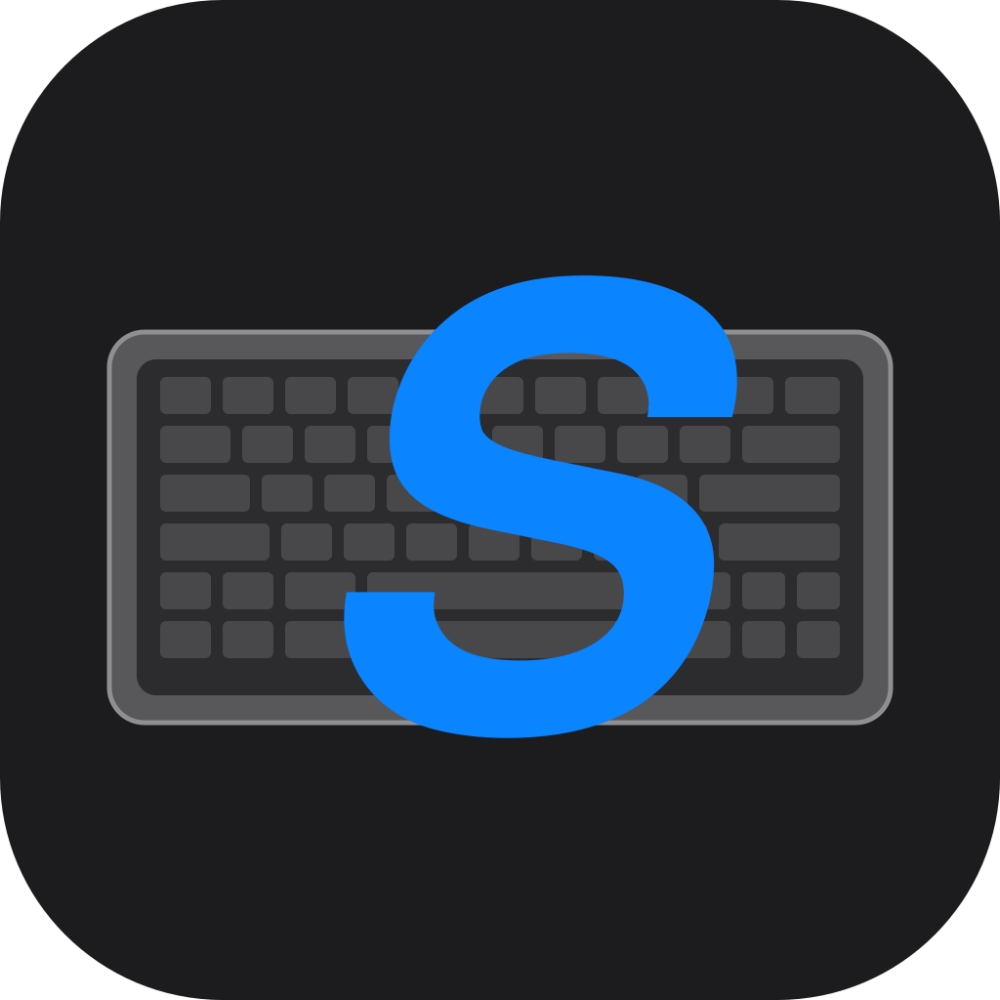

<h1 align="center">
  <br>
  
  <br>
  kbswitch
  <br>
</h1>

<p align="center">
  <b>Automatic keyboard layout switching for macOS</b>
  <br>
  <sub>Assign a layout to each physical keyboard. kbswitch switches instantly on connect/disconnect.</sub>
</p>

<p align="center">
  <a href="https://github.com/renaudallard/kbswitch/releases/latest"></a>
  
  
  
</p>

---

## Features

- **Instant switching** - layout changes the moment a keyboard connects or disconnects
- **Per-keyboard mapping** - assign a different input layout to each keyboard (built-in, USB, Bluetooth)
- **Native menu bar app** - lightweight, no dock icon, adapts to macOS Liquid Glass on Tahoe
- **Auto-update** - checks GitHub for new releases, downloads and installs with a progress bar
- **Launch at Login** - optional, via SMAppService

## Install

Download the DMG for your architecture from the
[latest release](https://github.com/renaudallard/kbswitch/releases/latest):

- **kbswitch-arm64.dmg** for Apple Silicon (M1/M2/M3/M4)
- **kbswitch-x86_64.dmg** for Intel

Open it and drag **kbswitch.app** to `/Applications`.

> [!WARNING]
> **Gatekeeper:** The app is not notarized by Apple. On first open, macOS will
> block it as unidentified. Go to **System Settings > Privacy & Security** and
> click **Open Anyway**, or right-click the app and select **Open**.
> You only need to do this once.

> [!IMPORTANT]
> **Input Monitoring:** On first launch, macOS will prompt for Input Monitoring
> permission (**System Settings > Privacy & Security > Input Monitoring**).
> This is required to detect keyboard connections.

## Usage

1. kbswitch appears in the menu bar (keyboard icon).
2. Click it to see connected keyboards with their current layout below.
3. Click the layout to open a dropdown and pick a different input source.
4. Mappings are saved automatically. When a mapped keyboard connects, its
   layout activates. When it disconnects, the remaining keyboard's layout
   takes over.

Use **Keyboard Settings...** to open System Settings and add or change input sources.
Use **Launch at Login** to start kbswitch automatically.
Use **Check for Updates...** to check for and install new versions.

## Build from source

```sh
bash build-app.sh              # arm64 app bundle (default)
bash build-app.sh x86_64       # x86_64 app bundle
swift build -c release --arch arm64   # binary only
```

## How it works

| Component | Details |
|---|---|
| **Keyboard detection** | IOKit HID Manager monitors connect/disconnect events in real time. Each keyboard is identified by vendor ID, product ID, and serial number. Mice are filtered by product name and key element count. |
| **Layout switching** | Carbon Text Input Source Services (`TISSelectInputSource`) changes the active input source. Redundant switches are skipped to avoid CPU overhead. |
| **Configuration** | Keyboard-to-layout mappings are stored in UserDefaults. |
| **Auto-update** | Checks GitHub releases on launch. Downloads the DMG, mounts it, replaces the app, strips quarantine, and relaunches. Shows a progress bar during download and a confirmation alert on completion. |
| **No dock icon** | Runs as an `LSUIElement` agent app. |

## Project structure

```
Sources/kbswitch/
    main.swift               Application entry point
    AppDelegate.swift        Status bar menu and keyboard events
    KeyboardMonitor.swift    IOKit HID keyboard detection
    InputSourceManager.swift Carbon TIS input source control
    KeyboardIdentifier.swift Vendor/product/serial identifier
    MappingStore.swift       UserDefaults persistence
    UpdateChecker.swift      GitHub release auto-updater
    LaunchAtLogin.swift      SMAppService login item toggle
    Info.plist               App bundle metadata
```

## License

BSD 2-Clause. See [LICENSE](LICENSE).
